# Current Translation Architecture

这份文档只描述当前仓库里已经生效的翻译架构。

先给结论：

- 插件已经适配新的统一翻译接口，真实翻译请求只走 `POST /v1/translate`。
- Web 没有直接发翻译请求。它现在只负责登录、定价、支付回跳、把网站登录态交给插件。
- 旧的服务端 task 架构已经删除：
  - 没有 `/v1/translate/tasks`
  - 没有 `/v1/translate/tasks/:id/stream`
  - 没有 `/cancel`
  - 没有 Durable Object
  - 没有 Cloudflare Queue
  - 没有 `translation_tasks` 表

## 1. 先回答“插件和 web 已经适配了吗”

### 插件

已经适配。

插件里现在所有走平台托管翻译的入口，最终都收敛到 `src/utils/platform/api.ts`：

- 普通同步翻译：`translateWithManagedPlatform(...)`
- 流式翻译：`streamManagedTranslation(...)`

这两个函数最终都请求同一个接口：

- `POST /v1/translate`

区别只在请求体里是否带 `stream: true`。

### Web

Web 也已经和新架构对齐，但它不是翻译客户端。

`apps/platform-web` 现在只做这几件事：

- 登录
- 定价页
- 支付成功页
- 扩展同步页

它不会直接调用 `/v1/translate`。真正调用平台翻译接口的是插件，不是 Web。

## 2. 总览

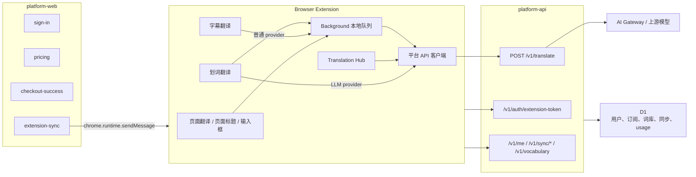

## 3. 现在哪些入口在翻译

当前主要有 6 个翻译入口：

1. 网页沉浸式翻译
2. 页面标题翻译
3. 输入框翻译
4. 字幕翻译
5. 划词翻译
6. Translation Hub

这 6 个入口最后不是都走同一条本地链路，实际分成 3 类：

- 走插件 background 本地队列：
  - 网页沉浸式翻译
  - 页面标题翻译
  - 输入框翻译
  - 字幕翻译
  - 划词翻译里的“普通 provider”分支
- 直连平台 SSE：
  - 划词翻译里的 LLM provider 分支
- 直连平台 JSON：
  - Translation Hub

## 4. 统一平台接口长什么样

服务端只保留了一个翻译路由：

- `POST /v1/translate`

它支持两种模式：

- JSON 模式：不传 `stream: true`
- SSE 模式：传 `stream: true`

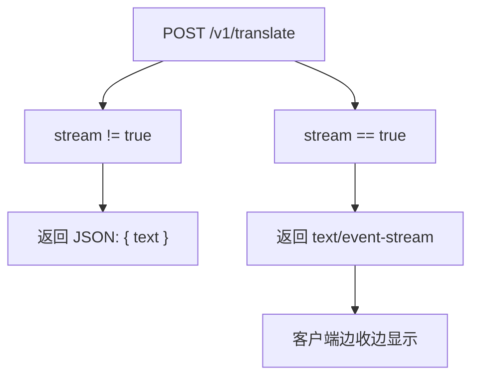

服务端翻译处理现在很简单：

1. 校验请求体
2. 根据 `scene` 组装 feature 名
3. 直接调用上游 chat completions
4. 记录 usage
5. 返回 JSON 或转发 SSE

不再有服务端任务创建、服务端排队、服务端恢复、task stream attach 这些步骤。

## 5. 插件里的公共层

### 5.1 Background 本地队列还在

删掉的是服务端 task/queue，不是插件本地队列。

插件 background 里还保留两层本地控制：

- `RequestQueue`
- `BatchQueue`

位置：

- `src/entrypoints/background/translation-queues.ts`

它们的职责是：

- 控制插件本地并发
- 在本地把多段文本合批
- 做本地缓存命中
- 给页面上的 loading 状态发本地通知

当前全局托管翻译并发常量是：

- `MANAGED_TRANSLATION_MAX_CONCURRENCY = 100`

### 5.2 平台客户端

平台客户端在：

- `src/utils/platform/api.ts`

这里面现在有三件事最重要：

- `platformFetch`：统一带 token 请求平台
- `translateWithManagedPlatform`：普通同步翻译
- `streamManagedTranslation`：流式翻译

### 5.3 文本翻译公共入口

大多数页面文本会先经过：

- `src/utils/host/translate/translate-text.ts`

这里会做几件事：

1. 整理文本
2. 根据 prompt、语言、provider、上下文算 hash
3. 生成 `statusKey`
4. 通过消息发给 background

## 6. 网页沉浸式翻译

入口：

- `translateTextForPage`

文件：

- `src/utils/host/translate/translate-variants.ts`

这条链路会先做页面级预处理：

- 收集网页上下文
- 可选生成网页 summary
- 检查文本是否已经是目标语言
- 检查是否命中 skip language

然后再走 `translateTextCore -> enqueueTranslateRequest -> background`。

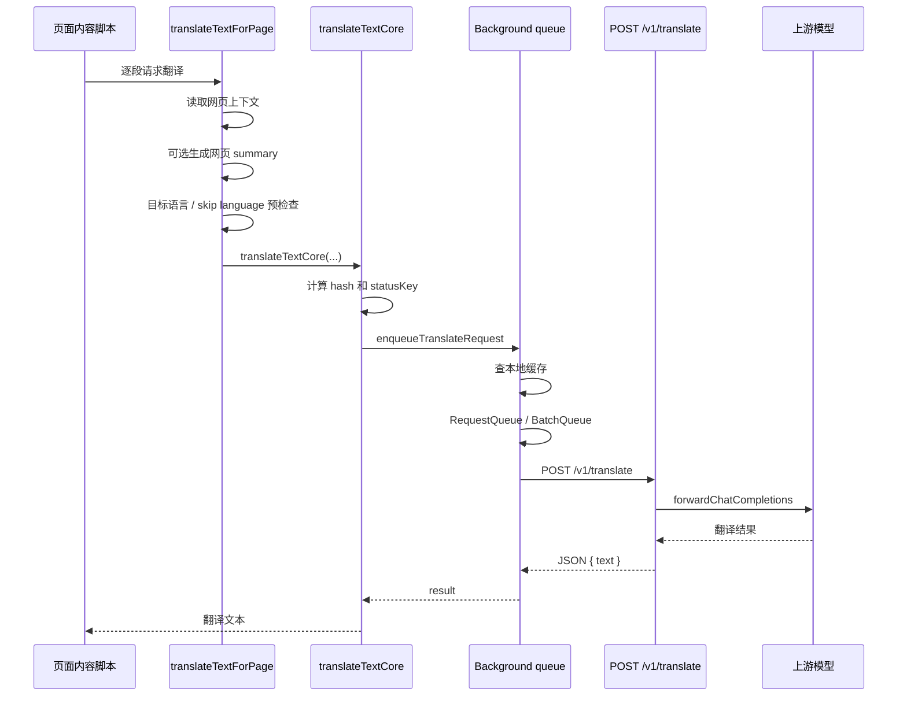

### 这一条链路的特点

- 可能先做网页上下文和 summary，首批请求会更重
- 如果 provider 是 LLM，background 会继续本地合批
- 如果 provider 不是 LLM，background 直接单条请求平台

## 7. 页面标题翻译

入口：

- `translateTextForPageTitle`

它和网页沉浸式翻译几乎一样，差别只有一个：

- 它强制把当前标题当作 `webTitle`

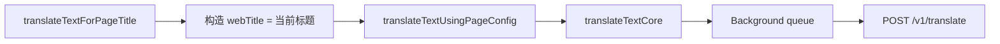

## 8. 输入框翻译

入口：

- `translateTextForInput`

文件：

- `src/utils/host/translate/translate-variants.ts`
- `src/entrypoints/selection.content/input-translation/use-input-translation.ts`

它和页面翻译的区别主要是语言方向：

- `fromLang`
- `toLang`

会先解析成最终的源语言和目标语言，再走 `translateTextCore`。

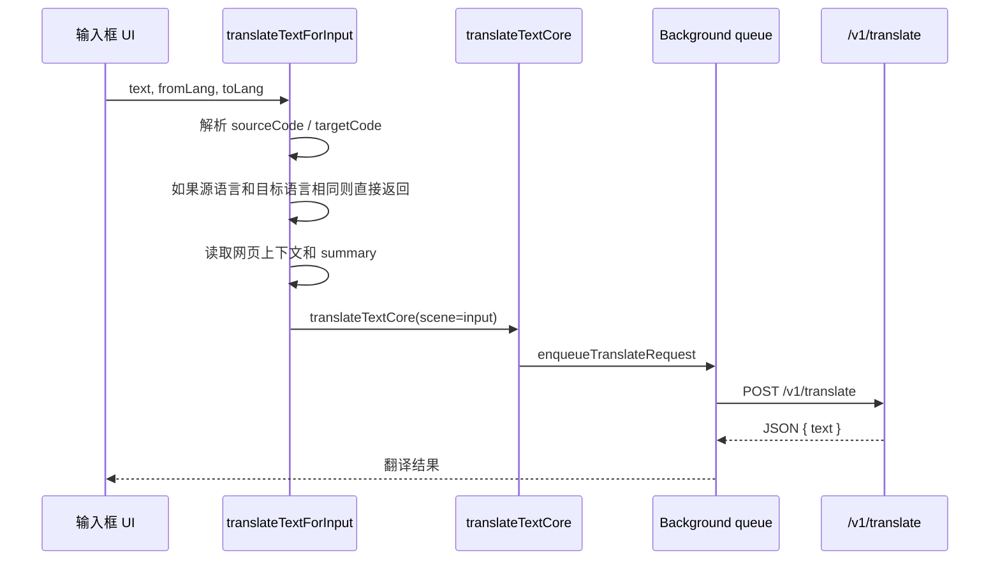

## 9. 字幕翻译

入口：

- `TranslationCoordinator`
- `translateSubtitles`

文件：

- `src/entrypoints/subtitles.content/translation-coordinator.ts`
- `src/utils/subtitles/processor/translator.ts`

字幕翻译比页面翻译多一层“时间窗口挑片段”。

顺序是：

1. `TranslationCoordinator` 根据当前播放时间，挑附近的未翻译字幕
2. 一次最多取 `TRANSLATION_BATCH_SIZE`
3. `translateSubtitles` 对每条字幕分别发 `enqueueSubtitlesTranslateRequest`
4. background 再按 provider 和语言做本地合批

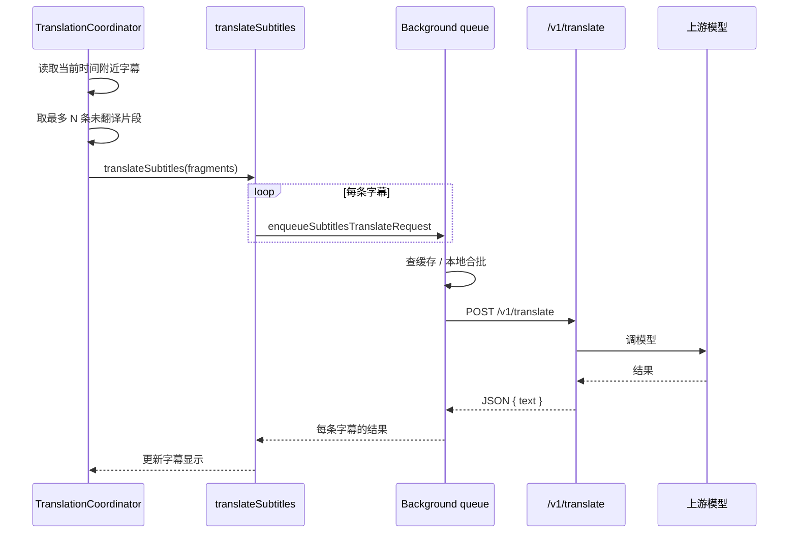

### 这条链路的特点

- 字幕先按播放时间挑片段
- 之后仍然复用 background 的本地队列和本地合批
- 如果所有字幕都失败，会抛出更友好的错误消息

## 10. 划词翻译

划词翻译有两条分支。

### 10.1 LLM provider：直连 SSE

入口：

- `translateWithLlm`

文件：

- `src/entrypoints/selection.content/selection-toolbar/translate-button/provider.tsx`

这条分支不走 background 队列，直接从内容脚本请求平台 SSE。

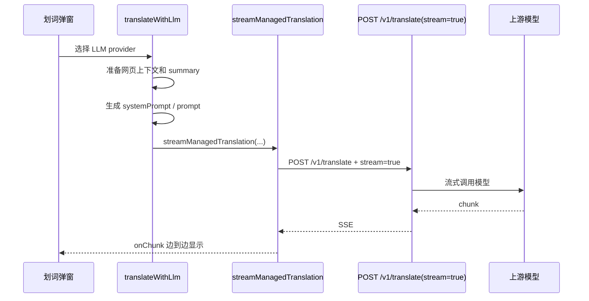

这条链路的特点：

- 直接流式显示
- 没有 background 本地队列
- 没有本地合批
- 只有本地 abort，没有服务端 task cancel

### 10.2 普通 provider：走 background 队列

入口：

- `translateWithStandardProvider`

它会走：

- `translateTextCore`
- `enqueueTranslateRequest`
- background 本地队列
- `/v1/translate`

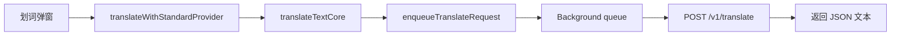

## 11. Translation Hub

入口：

- `TranslationCard`
- `executeTranslate`

文件：

- `src/entrypoints/translation-hub/components/translation-card.tsx`
- `src/utils/host/translate/execute-translate.ts`

Translation Hub 不走 background 队列。

它会直接：

1. 根据 provider 和语言生成 prompt
2. 调 `translateWithManagedPlatform`
3. 直接请求 `/v1/translate`

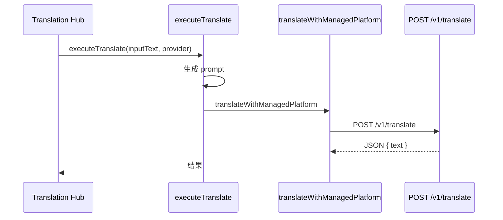

## 12. Web 到插件的认证桥接

这部分不是翻译链路，但它决定插件能不能调用平台 API，所以要单独写清楚。

Web 的主链路是：

1. 用户在 `platform-web` 登录
2. `extension-sync` 页面通过 `chrome.runtime.sendMessage` 把 Clerk token 发给插件
3. 插件 background 收到消息后，请求 `/v1/auth/extension-token`
4. 平台返回自己的 extension token
5. 插件把它存起来，后续所有 `/v1/translate`、`/v1/me`、`/v1/sync/*`、`/v1/vocabulary` 都带这个 token

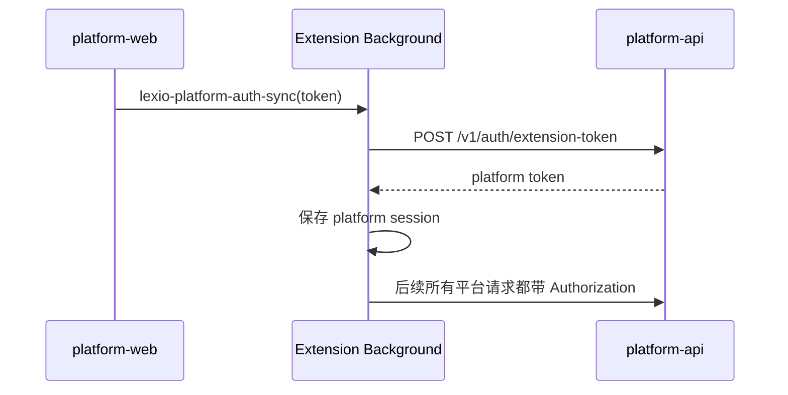

### Web 现在负责什么

- `sign-in`
- `pricing`
- `checkout-success`
- `extension-sync`

### Web 现在不负责什么

- 不直接发翻译请求
- 不直接请求 `/v1/translate`
- 不参与插件的本地排队和合批

## 13. 现在哪些数据还在 D1

翻译 task 不在 D1 里了，但平台自己的业务数据还在。

当前仍然会落 D1 的主要是：

- 用户
- 订阅
- entitlement
- usage
- 同步状态
- 词库

翻译结果本身主要有两层存放：

- 插件本地缓存：`db.translationCache`
- 平台侧 usage 记录：`recordUsage(...)`

## 14. 新架构和旧架构的区别

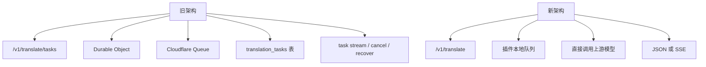

新的做法更简单：

- 服务端不再保存翻译任务状态
- 取消只靠客户端 `AbortController`
- 需要流式显示时，直接走 `/v1/translate` 的 SSE
- 需要普通结果时，直接走 `/v1/translate` 的 JSON
- 页面和字幕的“排队”只留在插件本地

## 15. 代码索引

最关键的文件是这些：

- 平台入口：`apps/platform-api/src/index.ts`
- 平台翻译路由：`apps/platform-api/src/routes/translate.ts`
- 插件平台客户端：`src/utils/platform/api.ts`
- background 本地队列：`src/entrypoints/background/translation-queues.ts`
- 文本翻译公共入口：`src/utils/host/translate/translate-text.ts`
- 页面 / 标题 / 输入框翻译：`src/utils/host/translate/translate-variants.ts`
- 划词翻译：`src/entrypoints/selection.content/selection-toolbar/translate-button/provider.tsx`
- 字幕翻译：`src/utils/subtitles/processor/translator.ts`
- 字幕调度：`src/entrypoints/subtitles.content/translation-coordinator.ts`
- Translation Hub：`src/utils/host/translate/execute-translate.ts`
- Web 认证桥接：`apps/platform-web/src/app/platform-auth.ts`
- 插件认证接收：`src/entrypoints/background/platform-auth.ts`

## 16. 一句话版本

现在的真实结构就是：

- Web 只负责账号和把登录态交给插件
- 插件负责所有翻译入口
- 页面和字幕走插件 background 本地队列
- 划词的 LLM 分支和 Translation Hub 直连 `/v1/translate`
- 服务端只做统一翻译转发，不再维护翻译 task
